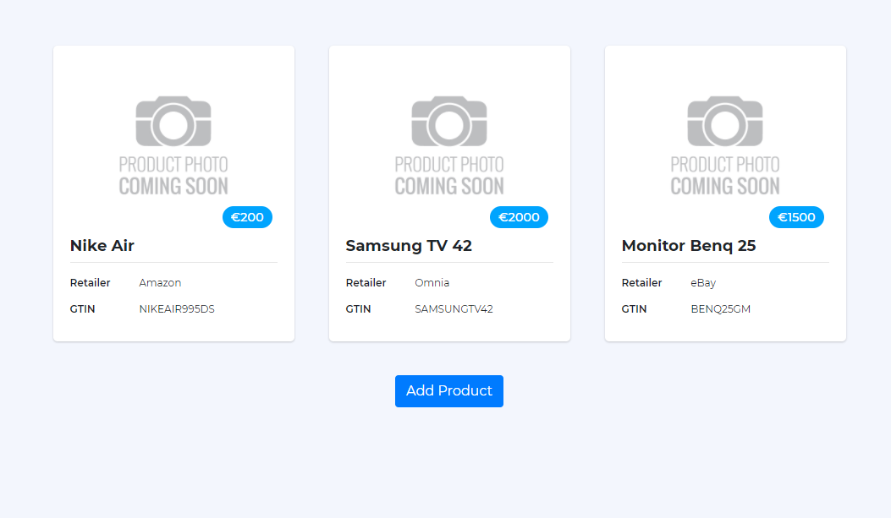
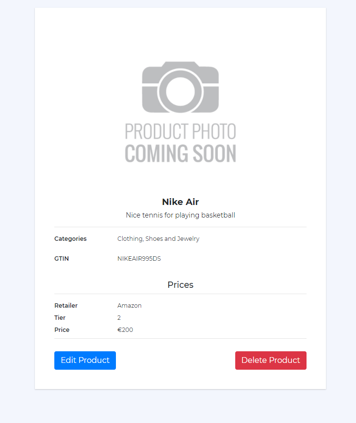
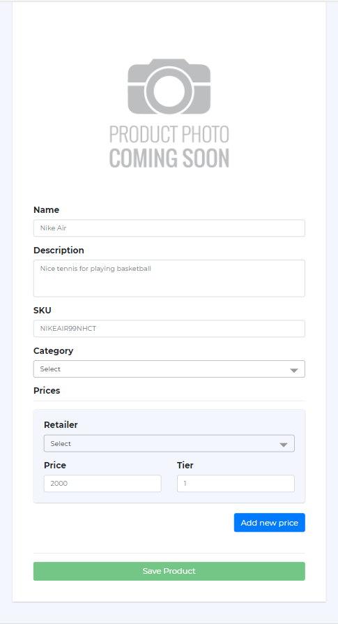
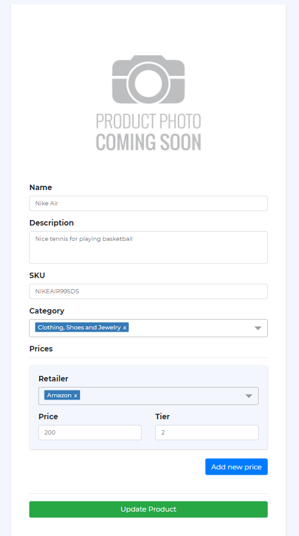
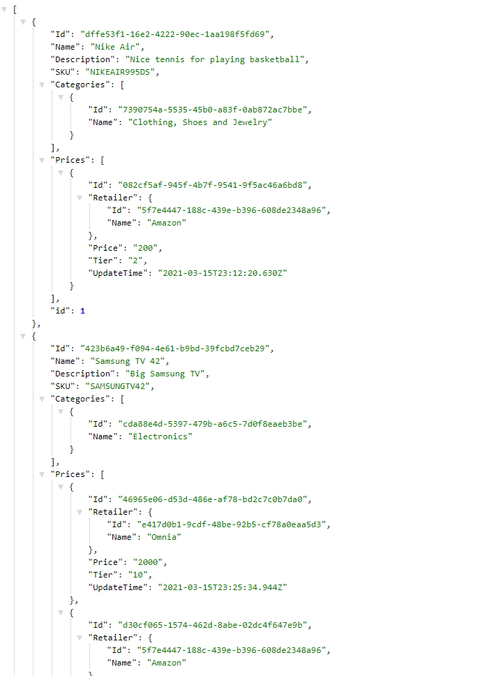

# Angular with NGRX - CRUD Example

Product CRUD example using Angular 11 and NGRX technologies

## Project Setup

#### Start the app
* Clone the Project - `https://github.com/bytebruno/omnia-front.git`
* Install the dependencies - `npm install` 
* Run fake api (json-server) - `npm run api`
* Start the web app - `npm start` or `ng serve`
* The application will be running on `http://localhost:4200` and the fake api on port `http://localhost:3000`

#### Run tests
* Run unit tests - `ng test`

## Technologies

* Angular 11
* NgRx

## Screenshots

### Product's list

### Product detail

### New product

### Update Product

### Fake database

